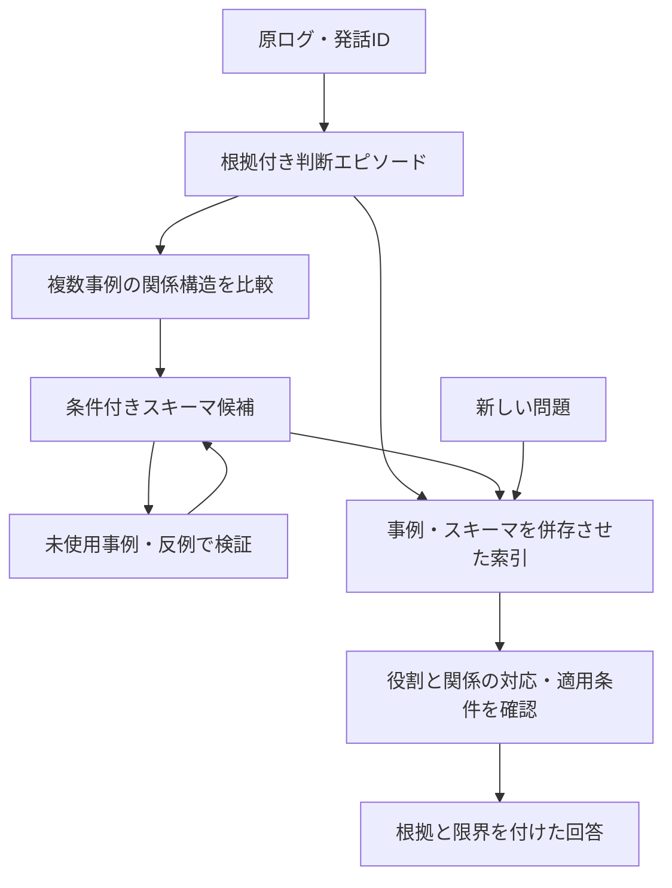

# 熟練知の抽象化・類推転移とStructured RAG：追加文献レビュー

確認日：2026-09-09。

[前回の6論文レビュー](expert-knowledge-six-papers.ja.md)の続編。今回提示された9本に、PKR-QAと題名が省略されていた目標指向KG研究を加え、11件を整理する。GraphRAGは前回との重複であり、新規の文献は10件となる。既存コード・設定・データ形式は変更しない研究メモである。

## 全体像

今回の研究課題は「熟練者の個別経験から条件付きの問題解決スキーマを抽出すると、未使用の別領域の課題への知識転移が改善するか」と整理できる。ただし、心理学での人間の類推研究、LLMによる手続き抽出、RAGの検索性能は、それぞれ異なる証拠である。これらを接続したシステム全体の有効性は、別途実験する必要がある。

| 文献 | 担当する問い | 得られる表現・設計視点 | 直接実証していないこと |
| --- | --- | --- | --- |
| Chi et al. (1981) | 熟練者は何で問題を分類するか | 表面的特徴と解法原理の区別 | 任意の異分野への熟練性の転移 |
| Gentner (1983) | 何を対応付けると類推になるか | 対象間の関係構造と体系性 | LLMによる写像の正しさ |
| Gick & Holyoak (1983) | 複数例からスキーマが形成されるか | 類似事例の比較と抽象化 | 産業ログからの自動的な汎用原理抽出 |
| Brown et al. (2025) | 文脈内の熟練判断をどう聞き出すか | CTA、CDM、ACTA | AIインタビュアー単独の妥当性 |
| Celino et al. (2025) | 産業の手続き知をどう管理するか | オントロジー、KG、対話AI、人の関与 | 異分野転移の性能向上 |
| Carriero et al. (2024) | 手続き文からKGを抽出できるか | ステップ・行為・対象・道具・時間 | 熟練者の判断理由や因果の自動復元 |
| RAPTOR (2024) | 異なる粒度の情報をどう検索するか | 再帰的クラスタリングと要約木 | 上位要約が汎用原理になること |
| GraphRAG (2024) | コーパス全体をどう俯瞰するか | グラフとコミュニティ要約 | 関係構造の類推写像 |
| HippoRAG (2024) | 文書をまたぐ関連をどう検索するか | KGとPersonalized PageRank | グラフ上の近さが因果・転用可能性を表すこと |
| PKR-QA / KML (2026) | 手続き関係を組み合わせて推論できるか | 手続きKG、QA、知識モジュール | 熟練者インタビューからの抽象スキーマ獲得 |
| Yano et al. (2026) | 目的・手段の知識を自然言語で検索できるか | 機能分解木とRAGインターフェース | 大規模・多領域への一般的優越 |

各節の「内容」は原典に関する整理、「応用案」は提示チャットを踏まえた本プロジェクト向けの解釈である。製造・制御などの例示は論文の実験結果として扱わない。

## 1. Chi, Feltovich & Glaser (1981)

**書誌：** Michelene T. H. Chi, Paul J. Feltovich, Robert Glaser. *Categorization and Representation of Physics Problems by Experts and Novices*. Cognitive Science, 5(2), 121–152。[出版社・DOI](https://doi.org/10.1207/s15516709cog0502_2)

**内容：** 物理問題の分類と知識表象を4つの実験で調べる。熟練者は解法を支える物理原理を、初心者は問題に登場する物体や状況などの表面的特徴を分類の手掛かりにしやすいという違いを示す。問題の見方そのものが解法知識の組織化と結び付いている。[出版社要旨](https://onlinelibrary.wiley.com/doi/10.1207/s15516709cog0502_2) / [著者による研究回顧](https://garfield.library.upenn.edu/classics1993/A1993LZ47400001.pdf)

**限界：** 物理領域の熟練者・初心者の比較であり、ベテランなら未知の産業領域でも優れるという結果ではない。深い表象が領域知識に支えられる点を落とさない。

**応用案：** 事例に「対象・工程」と「判断原理」の両方のラベルを持たせる。同じ原理が働く別工程と、同じ工程でも原理が異なる事例を検索評価に含める。「入力変動を切り分ける」といった原理は候補であり、個別ログの根拠と条件の確認が必要となる。

## 2. Gentner (1983)

**書誌：** Dedre Gentner. *Structure-Mapping: A Theoretical Framework for Analogy*. Cognitive Science, 7(2), 155–170。[出版社・DOI](https://doi.org/10.1207/s15516709cog0702_3) / [著者公開PDF](https://groups.psych.northwestern.edu/gentner/papers/Gentner83.2b.pdf)

**内容：** 類推を、基底領域から対象領域への関係構造の写像として説明する。個々の対象の属性より対象間の関係を写し、高次の関係により結び付いた体系を優先するsystematicity（体系性）を重視する。単に似た物体が登場することと、関係構造が対応することを区別する。[出版社要旨](https://onlinelibrary.wiley.com/doi/10.1207/s15516709cog0702_3)

**限界：** 理論的枠組みであり、LLMやKGの性能評価ではない。語彙が異なっても関係が似ることはあり得るが、それだけで転用先の因果関係が真になるわけではない。

**応用案：** 「ポンプ」「サーバー」という名称の類似度より、入力変化・応答遅延・制約・結果の対応を記録する。写像には、対応する役割、保たれる関係、対応しない条件、転用先で要確認の仮定を添える。提示チャットの「状況→関係→原因→判断→操作→結果」は独自の表現案であり、論文の公式スキーマではない。

## 3. Gick & Holyoak (1983)

**書誌：** Mary L. Gick, Keith J. Holyoak. *Schema Induction and Analogical Transfer*. Cognitive Psychology, 15(1), 1–38。[出版社・DOI](https://doi.org/10.1016/0010-0285(83)90002-6) / [原論文PDF](https://gwern.net/doc/psychology/1983-gick.pdf)

**内容：** 問題と解決を含む物語を読んだ後、内容は異なるが類似構造を持つ問題を解く実験で、スキーマ形成と転移を調べる。単一の類例に要約・原理説明・図を添える条件は顕著な成功を得られず、2つの類例から共通構造を抽象化する条件でスキーマ形成を促した。[出版社要旨](https://www.sciencedirect.com/science/article/pii/0010028583900026) / [原論文](https://gwern.net/doc/psychology/1983-gick.pdf)

**限界：** 人間による実験課題の結果であり、無関係な事例を増やせば自動的に転移できるという意味ではない。共通構造の把握と、適切な場面で類例を想起できることも区別する。

**応用案：** 複数事例の比較からスキーマ候補を作り、未使用事例・反例で適用条件を修正する。抽象化を生成した事例だけで妥当性を評価しない。一件の「音が異常なので回転数を落とした」から「異常時は常に負荷を下げる」を確定しない。

## 4. Brown, Power & Gore (2025)

**書誌：** Olivia Brown, Nicola Power, Julie Gore. *Cognitive Task Analysis: Eliciting Expert Cognition in Context*. Organizational Research Methods, 28(3), 375–404, 2025。[著者所属機関リポジトリ](https://livrepository.liverpool.ac.uk/3183762/) / [DOI](https://doi.org/10.1177/10944281241271216)

**内容：** CTAを、特定の仕事の文脈における複雑な認知と知識要件を聞き出す半構造化インタビュー群として説明する。高いリスクを伴う管理場面を扱うCDMと、グローバル・リーダーシップを扱うApplied Cognitive Task Analysis（ACTA）を例示する。文脈と具体的なタスクに密着して熟練判断を分析する方法論の論文である。[機関公開要旨](https://livrepository.liverpool.ac.uk/3183762/)

**限界：** 本メモは2025年の巻号年を採用する。公開リポジトリへの登録は2024年であり、年の違いを別論文と扱わない。AIとのチャットによるCTAの品質を直接評価してはいない。

**応用案：** 「何を観察したか」「何を予測したか」「予測と違った点」「他の選択肢」「判断を変える情報」を追質問する。質問例は本プロジェクトの案である。回答者の事後説明と当時の観察を分け、前回のCDM型エピソードと接続する。

## 5. Celino et al. (2025)

**書誌：** Irene Celino, Valentina Anita Carriero, Antonia Azzini, Ilaria Baroni, Mario Scrocca. *Procedural Knowledge Management in Industry 5.0: Challenges and Opportunities for Knowledge Graphs*. Journal of Web Semantics, 84, 100850, 2025。[出版社本文・要旨](https://www.sciencedirect.com/science/article/pii/S1570826824000362) / [DOI](https://doi.org/10.1016/j.websem.2024.100850)

**内容：** 作業者が持つwhat・how・whyの知識、特に手順やワークフローに関するhowの管理を論じる。オントロジーによる知識収集、NLP・LLMによる文書からのKG構築、Conversational AIによるアクセス、人が関与する品質・受容性の確保を結び付ける。[出版社要旨・Highlights](https://www.sciencedirect.com/science/article/pii/S1570826824000362)

**限界：** 課題と機会を整理する位置付けであり、熟練知RAGの異分野転移を実証した性能論文とは区別する。DOI中は2024だが巻号は2025年。

**応用案：** 抽出だけでなく、専門家の修正、更新、利用場面からのフィードバックまで含める。手続きとして正しいこと、判断理由が根拠に忠実なこと、作業者に役立つことを別々に評価する。

## 6. Carriero et al. (2024)

**書誌：** Valentina Anita Carriero, Antonia Azzini, Ilaria Baroni, Mario Scrocca, Irene Celino. *Human Evaluation of Procedural Knowledge Graph Extraction from Text with Large Language Models*. 本メモは2024年のarXiv版を参照する。[arXiv:2412.03589](https://arxiv.org/abs/2412.03589) / [本文v1](https://arxiv.org/html/2412.03589v1) / [関連出版版DOI](https://doi.org/10.1007/978-3-031-77792-9_26)

**内容：** 手続き文からステップ、行為、対象、道具、時間情報を抽出し、所定のオントロジーに従ってKGへ変換する。半構造化抽出とRDF化を分けたプロンプト連鎖を使う。3つの手続き、180名の評価では、知覚された品質の中央値は5段階中4、有用性は3だった。人が評価したのは主に半構造化出力であり、全員がRDFを検証したわけではない。[本文 §6–8](https://arxiv.org/html/2412.03589v1)

**限界：** 実際の作業成功や産業現場全体の効果を測った結果ではない。道具のような暗黙情報の推定を含み得るので、原文からの抽出と補完を分ける必要がある。出版版との全差分・巻号年の照合は未実施。

**応用案：** JSON等で意味内容を確認してからKGにする。スキーマへの適合、原文への忠実性、実用上の効果を独立に検証する。手順抽出から、理由や一般原理も正しく得られるとは仮定しない。

## 7. RAPTOR (ICLR 2024)

**書誌：** Parth Sarthi, Salman Abdullah, Aditi Tuli, Shubh Khanna, Anna Goldie, Christopher D. Manning. *RAPTOR: Recursive Abstractive Processing for Tree-Organized Retrieval*. ICLR 2024。[会議論文](https://openreview.net/pdf?id=GN921JHCRw) / [arXiv](https://arxiv.org/abs/2401.18059)

**内容：** チャンクの埋め込み・クラスタリング・要約を再帰的に行い、異なる要約粒度の木を構築する。検索時に複数の抽象度から情報を取得し、長文の文脈を利用する。複数のQA課題で従来の検索拡張方式に対する改善を報告する。[会議論文要旨](https://openreview.net/pdf?id=GN921JHCRw)

**限界：** 上位ノードは要約であり、検証された領域非依存の原理ではない。提示チャットの「工程ノウハウ→変動要因の分離→複雑系の原理」という階層は応用仮説で、RAPTORの標準出力や実験結果ではない。

**応用案：** 原事例と横断要約を両方検索できる索引として比較する。抽象スキーマには要約とは別の型と検証状態を付ける。生成された上位文から元事例へのリンクを保つ。

## 8. GraphRAG (Edge et al., 2024)：前回からの接続

**書誌：** Darren Edge et al. *From Local to Global: A Graph RAG Approach to Query-Focused Summarization*. arXiv:2404.16130, 2024。[原典](https://arxiv.org/abs/2404.16130) / [前回レビュー](expert-knowledge-six-papers.ja.md)

**内容：** エンティティ・関係のグラフとコミュニティ要約を作り、コーパス全体の問いへの部分回答を統合する。大規模コーパスのglobal sensemakingで、単純なRAGに対し網羅性・多様性の改善を報告する。[原典要旨](https://arxiv.org/abs/2404.16130)

**限界：** 共通テーマの要約と、類推による関係構造の対応付けは異なる。caused_byやleads_toという辺名を付けても、因果が検証されたことにはならない。

**応用案：** 抽出済みの事例・スキーマの俯瞰層として使い、原理候補の発見を支援する。検索で得た関係の根拠と、転用先で成立する条件は別途確認する。

## 9. HippoRAG (NeurIPS 2024)

**書誌：** Bernal Jiménez Gutiérrez, Yiheng Shu, Yu Gu, Michihiro Yasunaga, Yu Su. *HippoRAG: Neurobiologically Inspired Long-Term Memory for Large Language Models*. Advances in Neural Information Processing Systems 37, 2024。[会議ページ](https://proceedings.neurips.cc/paper_files/paper/2024/hash/6ddc001d07ca4f319af96a3024f6dbd1-Abstract-Conference.html) / [arXiv](https://arxiv.org/abs/2405.14831)

**内容：** LLM、KG、Personalized PageRankを組み合わせ、文書をまたぐ知識統合のための検索を行う。multi-hop QAで既存RAG手法に対する改善を報告し、反復的な検索との性能・効率も比較する。[会議要旨](https://proceedings.neurips.cc/paper_files/paper/2024/hash/6ddc001d07ca4f319af96a3024f6dbd1-Abstract-Conference.html)

**限界：** ここでは初代HippoRAGを扱い、HippoRAG 2の結果は混ぜない。PPRによる関連度は、因果推論や類推写像の正しさそのものではない。提示チャットの「品質変動→外乱→仮説→切り分け」は独自の索引案である。

**応用案：** 一つの類似チャンクに収まらない根拠を集める方法として比較する。検索された複数事例について、共通する関係と適用条件を判定する段階を別に置く。

## 10. PKR-QA / Knowledge Module Learning (AAAI 2026)

**書誌：** Thanh-Son Nguyen, Hong Yang, Tzeh Yuan Neoh, Hao Zhang, Ee Yeo Keat, Basura Fernando. *PKR-QA: A Benchmark for Procedural Knowledge Reasoning with Knowledge Module Learning*. Proceedings of the AAAI Conference on Artificial Intelligence, 40(29), 24549–24557, 2026。[会議ページ・要旨](https://ojs.aaai.org/index.php/AAAI/article/view/39638) / [DOI](https://doi.org/10.1609/aaai.v40i29.39638)

**内容：** COINの手順動画データとオントロジーを基に、ConceptNetやLLM出力で補い、人手検証した手続きKGを構築する。グラフ探索テンプレートでQAを生成し、手続き関係を学ぶニューラルモジュールを合成するKMLを提案する。ベンチマーク上の推論性能改善と解釈可能な推論トレースを報告する。[会議要旨](https://ojs.aaai.org/index.php/AAAI/article/view/39638)

**限界：** 熟練者のチャットログから汎用スキーマを帰納した評価ではない。複数分野を含むことと、未学習分野への転移を実証することも同じではない。

**応用案：** 手順間・対象間の関係を使う評価問題の設計を参考にする。自動生成テンプレートだけに依存せず、専門家が作る未使用事例と適用不能な類例も含める。

## 11. 目標指向KGとRAG：Yano et al. (2026)

**特定について：** 提示文に正式題名がなかったため、「2026年」「機能分解木」「目標指向KG」「自然言語検索」に一致する以下の論文を対応候補として収録する。元チャットのリンクそのものがないため、同一文献であるという断定はしない。

**書誌：** Kosuke Yano, Yoshinobu Kitamura, Kazuhiro Kuwabara. *RAG-Based Natural Language Interface for Goal-Oriented Knowledge Graphs and Its Evaluation*. Information, 17(1), 55, 2026。[出版社ページ](https://www.mdpi.com/2078-2489/17/1/55) / [DOI](https://doi.org/10.3390/info17010055)

**内容：** 手続き知を表す機能分解木を対象に、自然言語から目的・行為・達成方法などを取り出すRAGインターフェースを扱う。会計監査の資産グルーピングを例に、専門家が正解項目を評価し、ChatGPT-4o、Microsoft GraphRAGのlocal searchと比較する。[出版社掲載の §5](https://www.mdpi.com/2078-2489/17/1/55)

**限界：** 限定された題材・問いでの比較を、大規模な一般優越と解釈しない。構造化済み機能分解木の利点と、検索方式自体の利点が混ざり得る。本文ページの直接取得は不安定で、出版社の検索収録本文を確認した範囲にとどまる。

**応用案：** 「何をするか」に加え「何のためか」「どの方法を選ぶか」を知識型として保持する。既存のKGへの自然言語アクセスと、会話からのKG構築を別工程として評価する。

## 12. 前回レビューと接続した設計仮説

前回は原ログから判断エピソード・戦略・概念／プロセス・全体俯瞰への接続を提案した。今回は、その上に**事例間の関係対応と、転用条件付きスキーマ**を加える。以下は統合提案であり、収録論文が一括して検証した方式ではない。

| 情報のまとまり | 項目案 | 保存上の注意 |
| --- | --- | --- |
| Situation | Goal、Constraints、Observations | 当時得られた情報と後知恵を区別 |
| Recognition | Cues、Anomaly、Hypothesis | 観察と原因仮説を区別 |
| Decision | Options、Selected Action、Rationale | 発言のない理由を確定しない |
| Result | Expected Outcome、Actual Outcome、Feedback | 期待と実績を分離 |
| Abstraction | Principle、Preconditions、Failure Conditions | 未検証の候補を確立済み原理と混ぜない |
| Analogical Mapping | Source/Target Roles、Mapped Relations、Unmatched Constraints | 何が対応し、何が対応しないかを明示 |
| Evidence | Turn IDs、Supporting Cases、Counterexamples、Review Status | 原ログまで戻れる参照を保持 |

この項目表はJSON Schemaの実装ではない。推定・本人の申告・直接観測・専門家確認という区別と、適用条件の更新履歴を持たせる。ログに存在しない因果を補完する場合は仮説と表示し、追加質問へ戻す。

特に、**階層の上へ要約すること、因果関係を確かめること、異分野の対応を作ることは別の処理**である。RAPTOR・GraphRAG・HippoRAGは候補の発見や検索を助けるが、それだけで抽象原理の真偽や転用可能性は保証されない。

## 13. 比較実験案

中心となる3条件は提示チャットに沿う。ただし抽象化と検索方式の変更を一度に行うと、改善の原因が分からなくなるため、補助条件を置く。

| 条件 | 入力・表現 | 検索 | 主に測りたい差 |
| --- | --- | --- | --- |
| A: Vanilla RAG | 原ログのチャンク | ベクトル検索 | 基準 |
| B: Structured RAG | 根拠付きエピソード | Aと同じ検索方式 | 構造化の効果 |
| C: Abstract Knowledge RAG | エピソード＋検証対象のスキーマ | KG＋ベクトル検索 | 統合方式としての効果 |
| 補助C1 | B＋スキーマ | Bと同じ検索方式 | 抽象化自体の寄与 |
| 補助C2 | Bのみ | Cと同じ検索方式 | グラフ検索自体の寄与 |

抽出・回答モデル、評価問題、回答時に渡す情報量を可能な限りそろえ、構築費用と検索費用は別途記録する。検索対象の個数だけでは情報量がそろわないため、文脈トークン数も報告する。

| 指標 | 評価案 |
| --- | --- |
| Retrieval Recall | 問題ごとに必要な根拠エピソード群を人手で定義し、上位検索結果からたどれる根拠の再現率を測る |
| 回答妥当性 | 目標・制約・手順・理由を専門家が共通基準で採点 |
| Faithfulness | 原事例とスキーマが支持しない主張の割合、参照の正確性 |
| Transfer | 分野を分けて保持した未使用問題での成績。見た目が似るだけの反例も含む |
| 有用性 | 判断支援としての評価と、可能なら実際の判断課題成績を分離 |
| 適用限界の認識 | 条件不一致・根拠不足で不適用や追加確認を示せるか |
| 負担 | 構築・問い合わせ費用、遅延、人間の修正時間 |

データ分割は**スキーマ生成より先**に行う。同一エピソードの断片や評価分野の事例を抽出側へ漏らさない。「検索に未収録の分野」と「基盤LLMの事前学習でも未知の分野」は区別し、後者を確認なしに主張しない。回答を採点する専門家には方式名を伏せ、評価者間の一致も確認する。

## 14. 読む順序と確認範囲

理論から設計を進めるならChi → Gentner → Gick & Holyoak、抽出工程なら前回のCDM・Cho・PKAIとBrown・Carrieroを接続する。産業運用の視点はCelino、検索方法の比較はRAPTOR・GraphRAG・HippoRAG、手続き推論と目的・手段の表現はPKR-QA・Yanoを参照する。

今回の確認は、出版社・会議・著者所属機関・arXivの書誌と要旨を基礎とし、Gick & Holyoakの原論文公開写し、CarrieroのHTML本文、Yanoの出版社検索収録本文などを補った。Chiは著者の研究回顧も参照した。全論文の全実験・付録を精査した系統的レビューではなく、確認していない細部や効果量は記載していない。題名のない研究は第11節で候補と明示した。

原典は各節のリンクから参照できる。既存の実装変更や実験結果を含む文書ではない。
