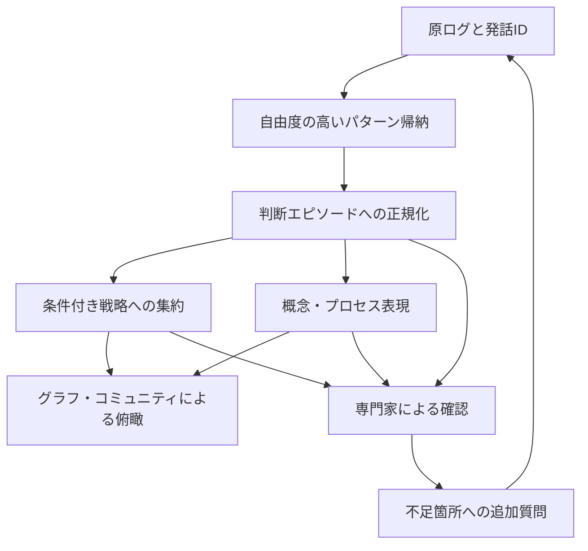

# 熟練者チャットログからの知識抽出：6論文の整理

確認日：2026-09-07。依頼時に提示されたチャットを基に、一次資料で確認できた内容・書誌情報を補正した日本語レビュー。

この文書は研究メモであり、既存の Interview RAG の実装・設定・データ形式を変更するものではない。

## 全体像

6本は、熟練知を発見する対象、抽出・構造化の方法、大量化した知識の探索という異なる課題を扱う。共通の成果として一つの方式が実証されたわけではないが、ログを単に短く要約するより、原発話・判断エピソード・条件付き戦略・概念／プロセス・全体俯瞰を相互にたどれる形にする設計を考える材料になる。

| 論文 | 主な問い | 知識の表現・方法 | 本プロジェクトで参考になる点 |
| --- | --- | --- | --- |
| Cho et al. (2026) | 行動例からLLMが有用な暗黙知を外在化できるか | 自然言語による判断ノウハウ | ログから帰納する意義、下流課題による評価 |
| Klein et al. (1989) | 熟練者の判断の何を聞き出すか | Critical Decision Method（CDM） | 重要な手掛かりと判断点を抽出単位にする |
| Cooke (1994) | 知識獲得手法をどう選ぶか | 手法の分類・比較レビュー | 得たい知識に合わせて複数の表現を使う |
| Schinckus et al. (2026), PKAI | 知識獲得の全工程をLLMで支援できるか | 会話、構造化文書、フローチャート、BPMN | 暫定構造を専門家が修正する循環 |
| Yang et al. (2026), METRO | 対話から戦略と計画を帰納できるか | Strategy Forest | 状態に応じた行動と長期的な行動系列 |
| Edge et al. (2024), GraphRAG | コーパス全体に関する問いにどう答えるか | エンティティグラフとコミュニティ要約 | 大量ログの横断探索・俯瞰 |

以下では「論文の内容」と「本プロジェクトへの示唆」を分ける。後者および第7節以降は設計上の解釈・提案であり、各論文が直接検証したものではない。

## 1. Cho et al. — 行動例から暗黙知を外在化する

**書誌情報：** Mina Cho, Russell J. Funk, Alok Gupta, Mochen Yang. *Large Language Models Explain Experts Better Than Experts Themselves*. 2026, arXiv:2608.07488。参照版はv1、プレプリントとして扱う。[書誌・原文](https://arxiv.org/abs/2608.07488) / [本文](https://arxiv.org/html/2608.07488v1)

**論文の内容：** 数学チュータリングの応答例から判断ノウハウを抽出し、LLMの応答生成と初心者への知識移転に利用する。比較対象の Human Best Effort は、先行研究のCTAインタビューから得られた3段階モデルである。対話例のみを与える条件と、その3段階構造も要求する条件などを比較し、対話例に基づく外在化の有用性を報告する。主実験では形式を強制しない条件が有力だった。[本文 §2–4](https://arxiv.org/html/2608.07488v1)

**限界・読み方：** データは、学習者と初心者チューターの会話に専門家の代替応答を付したもので、「専門家の自然な長期対話をそのまま観察した」とは異なる。初心者への移転の優位性には caring（配慮）の寄与が大きく、数学指導能力全般の優越を意味しない。弱いモデルでは優位性が再現されない分析もあり、固定形式が常に悪いという結論にはできない。[本文 §3.1、§4、§5](https://arxiv.org/html/2608.07488v1)

**本プロジェクトへの示唆：** 自由記述で候補パターンを発見してから正規化する方式を、最初からJSON Schemaを指定する方式と比較する価値がある。インタビューで語られた経験と、ログに直接記録された行動は区別して保存する。

## 2. Klein et al. — 判断点と手掛かりを掘り下げる

**書誌情報：** Gary A. Klein, Roberta Calderwood, Donald MacGregor. *Critical Decision Method for Eliciting Knowledge*. IEEE Transactions on Systems, Man, and Cybernetics, 19(3), 462–472, 1989。[原典・DOI](https://doi.org/10.1109/21.31053)

**論文の内容：** CDMは、具体的な重要事例を使い、熟練した判断を成立させた情報を質問で掘り下げる知識獲得法である。重要な手掛かり、知覚的・概念的な識別、典型性の判断などを対象とする。一般的な心得だけでは見えない、状況依存の判断根拠に注目する。[原典要旨](https://doi.org/10.1109/21.31053)

**限界・読み方：** インタビュー法であり、LLMによるログ抽出アルゴリズムではない。今回の確認範囲は書誌と公開要旨で、本文全体は取得できていない。以下の項目一覧や質問例は、提示チャットのCDM解釈を本プロジェクト向けに整理したものであり、1989年論文の公式スキーマの転載ではない。

**本プロジェクトへの示唆：** トピック単位だけでなく、判断エピソードを残す。「状況 → 気づいた手掛かり → 解釈 → 目標 → 行動 → 理由 → 結果」を結び付け、「その情報がなければ判断は変わったか」「初心者が見落とす点は何か」を追加質問候補にする。ログにない選択肢や反実仮想をLLMが事実として補完しないことが重要である。

## 3. Cooke — 知識に合わせて手法と表現を選ぶ

**書誌情報：** Nancy J. Cooke. *Varieties of Knowledge Elicitation Techniques*. International Journal of Human-Computer Studies, 41(6), 801–849, 1994。[出版社ページ](https://www.sciencedirect.com/science/article/abs/pii/S1071581984710834) / [DOI](https://doi.org/10.1006/ijhc.1994.1083)

**論文の内容：** 複数分野に分散した知識獲得手法を方法論的な類似性で分類し、各分類の強み、弱み、適用先を整理したレビューである。万能な抽出手順を提案する研究ではなく、目的に応じた方法選択の基礎となる。[出版社要旨](https://www.sciencedirect.com/science/article/abs/pii/S1071581984710834)

**限界・読み方：** 今回は出版社の書誌・要旨を確認し、本文全体は取得できていない。提示チャットの「観察・インタビュー／プロセス追跡／概念的手法」という整理は設計検討の手掛かりとして扱い、個別技法や分類の細部の原文照合は保留する。

**本プロジェクトへの示唆：** 同じログから、判断の系列、手順、概念間の関係を別々に表せるようにする。ただし、事後的なインタビューを系列に並べ直しても、実際のタスク遂行を直接観察したprocess tracingのデータになるわけではない。自己申告・観察・推定という証拠の種類を維持する必要がある。

## 4. Schinckus et al. / PKAI — 聞き出しと構造化を往復する

**書誌情報：** Malik Schinckus, Anthony Simonofski, Nicolás Bono Rosselló. *Large Language Models for Process Knowledge Acquisition: Designing and Evaluating a Multi-agent System*. Business & Information Systems Engineering, 68, 7–33, 2026。オンライン公開は2025-12-15、巻号は2026年。[出版社本文・DOI](https://doi.org/10.1007/s12599-025-00976-w)

**論文の内容：** 業務プロセスの知識獲得を、Preparation（準備）、Socialization（対話）、Externalization（形式化）の3段階で支援するPKAIを提案する。19の設計要件を定義し、経験ある分析者11名へのインタビュー、準実験への26名の参加、実組織の事例を用いて評価した。26名は参加時の人数で、全員が最終分析に含まれたわけではない。[本文 §3、§6](https://link.springer.com/article/10.1007/s12599-025-00976-w)

回答の不足を追質問し、暫定フローチャートを専門家が確認する。成果物には文書、半構造化情報、BPMN、会話履歴を含む。生成物を使う分析者では意味的・実用的な品質の改善が見られる一方、制御フローなどの課題が残る。[本文 §5–6](https://link.springer.com/article/10.1007/s12599-025-00976-w)

**限界・読み方：** プロセス発見の研究であり、あらゆる熟練判断の抽出を実証したものではない。PKAI支援条件を、専門家の入力や確認を含まない完全自律システムと解釈しない。

**本プロジェクトへの示唆：** 抽出結果を確認用の材料にする。「この分岐の条件がない」「理由と行動が矛盾する」といった不足を追加インタビューへ戻す。BPMNの導入自体よりも、修正履歴と原発話への追跡可能性が参考になる。

## 5. Yang et al. / METRO — 条件付き戦略を多数の対話から統合する

**書誌情報：** Haofu Yang, Jiaji Liu, Chen Huang, Faguo Wu, Wenqiang Lei, See-Kiong Ng. *METRO: Towards Strategy Induction from Expert Dialogue Transcripts for Non-collaborative Dialogues*. ACL 2026, Volume 1: Long Papers, 21385–21416。[ACL Anthology](https://aclanthology.org/2026.acl-long.978/) / [DOI](https://doi.org/10.18653/v1/2026.acl-long.978) / [参照した手法本文：arXiv v1](https://arxiv.org/html/2604.11427v1)

**論文の内容：** 対話から戦略行動と計画を帰納し、Strategy Forestにまとめる。対話状態をクラスタリングし、状態ごとの木に行動系列を集約する。根の直下は次の行動、枝は長期的な行動の道筋を表す。直後の反応から有効性を評価し、有効な行動の一般化と、避けるべき行動の抽出を行う。枝の選別には成果だけでなく観測数とWilson下限に基づく信頼性も使う。[本文 §3、付録A](https://arxiv.org/html/2604.11427v1)

交渉・説得の2ベンチマークで、既存手法を平均9–10%上回ると報告する。この数値を本プロジェクトの改善予測には使えない。[ACL要旨](https://aclanthology.org/2026.acl-long.978/)

**限界・読み方：** データの参加者を一律に職業的熟練者と見なさない。また、木の各ノードが毎回明示的な「反応・次状態」を格納する構造だと断定しない。基本は状態ごとの行動系列であり、提示チャットの状態遷移表現は応用上の読み替えである。

**本プロジェクトへの示唆：** 戦略に適用条件、推奨行動、回避行動、後続の展開、根拠エピソードを持たせる。失敗も条件付き知識として残し、成功率と支持事例数を分けて表示する。LLMが付けた成功判定と実際の観測結果も区別する。

## 6. Edge et al. / GraphRAG — 大量の知識を俯瞰する

**書誌情報：** Darren Edge, Ha Trinh, Newman Cheng, Joshua Bradley, Alex Chao, Apurva Mody, Steven Truitt, Jonathan Larson. *From Local to Global: A Graph RAG Approach to Query-Focused Summarization*. 2024, arXiv:2404.16130。[原文・書誌](https://arxiv.org/abs/2404.16130)

**論文の内容：** 個別情報の検索だけでは答えにくい、コーパス全体の主要テーマなどの問いを扱う。文書からエンティティと関係を抽出してグラフを作り、密に関連するコミュニティごとの要約を準備する。質問に応じた部分回答を生成し、全体回答へ統合する。約100万トークン規模のデータで、単純なRAGベースラインより回答の網羅性・多様性が改善したと報告する。[原典要旨](https://arxiv.org/abs/2404.16130)

**限界・読み方：** ここで扱うのは2024年の論文の主張であり、現在のGraphRAG実装全体の仕様ではない。熟練知抽出自体の評価ではなく、すべての質問でベクトル検索を上回るという結果でもない。

**本プロジェクトへの示唆：** ログが増えた段階で、判断エピソードや戦略を横断する探索層として検討する。Situation、Cue、Goal、Strategy、Constraint、Outcome、Exceptionなどをノードにする案は、本文から直接導かれる必須仕様ではなく、本プロジェクト向けの提案である。要約からも元の根拠へ戻れるようにする。

## 7. 6本を組み合わせた設計仮説

以下のパイプライン全体を検証した論文は、この6本にはない。提示チャットの統合案を、今後検証する仮説として整理する。

矢印は原データを置き換えることを意味しない。各層を併存させ、上位の主張から下位の根拠へ参照を残す。

| 層 | 保存する情報の案 | 主に参考にする論文 |
| --- | --- | --- |
| Raw Evidence | セッション・発話ID、話者、原文、文脈、証拠の種類 | PKAI、Cho |
| Decision Episode | Situation / Cues / Interpretation / Goal / Options / Action / Rationale / Expected Outcome / Actual Outcome / Counterfactual / Provenance | CDM |
| Strategy | 適用状態、推奨・回避行動、予想反応、後続戦略、成果、支持事例と反例 | METRO |
| Concept / Process | 概念間の関係、役割、手順、分岐条件、制約、例外 | Cooke、PKAI |
| Corpus-level Summary | 共通原則、相違点、矛盾、例外、各集約の根拠へのリンク | GraphRAG |

これは項目候補であり、正式なJSON Schemaや実装変更ではない。特に次を設計条件とする。

- **不明を保存する：** 語られていない理由や結果を、空欄回避のために生成しない。観測・本人の申告・LLMの推定・専門家の確認を分ける。
- **期待と実績を分ける：** 「こうなると思った」と「実際にこうなった」を別の情報として扱う。
- **集約の根拠を保持する：** StrategyからEpisode、Episodeから発話へ戻れるようにする。支持例の件数に加え、反例と適用条件も残す。
- **矛盾を消さない：** 専門家、時期、状況の違いで結論が分かれる場合、一つの原則に無理に統合しない。
- **抽出形式を比較する：** 自由帰納→正規化と固定スキーマによる直接抽出を、同じログで評価する。Choの結果だけで前者を採用決定しない。

## 8. 評価と既存MVPとの関係

現行READMEでは、6種類のKnowledge（fact / experience / decision / reason / lesson / preference）を抽出し、Ollama EmbeddingとFAISSで検索する最小実験環境が説明されている。GraphRAG等は将来拡張として扱われている。この研究メモは、その比較検討用の背景資料に位置付ける。

今後の検証では、少なくとも以下を分けて測る。

| 評価対象 | 確認内容の案 |
| --- | --- |
| 根拠への忠実性 | 原発話が主張を支持するか。捏造した理由・条件が混入していないか |
| 専門家による確認 | 手掛かり、理由、適用条件、例外が妥当か。修正が必要な項目は何か |
| 複数事例での支持 | 別ログでも成立するか。支持数・反例数・専門家間の差はどうか |
| 再利用時の効果 | 新人やLLMの判断品質、失敗回避、根拠提示が改善するか |
| 横断探索 | 全体の共通原則や相違点を拾えるか。根拠のない一般化が増えないか |
| 運用負担 | 抽出費用、処理時間、人間の確認・修正時間は許容できるか |

比較候補は、原ログの直接検索、現行の構造化Knowledge検索、自由帰納後の正規化、戦略を追加した検索、全体俯瞰を追加した検索とする。抽出に使用した事例をそのまま効果測定に使わず、未使用の事例で評価する。同じエピソードの断片が学習側と評価側にまたがることも避ける。成功率の向上だけで因果効果を主張しない。

着手順の仮説は、まずChoとCDMを参考に根拠付きエピソードの抽出を比較し、PKAI型の確認・追質問を試す。その後、複数ログが蓄積してからMETRO型の戦略統合を評価する。Cookeは表現選択の視点、GraphRAGは大量化後の俯瞰候補として扱う。

## 9. 確認範囲と提示チャットからの補正

| 対象 | 今回の確認範囲・補正 |
| --- | --- |
| Cho | arXiv本文・書誌を確認。CTAの比較知識は先行研究由来。専門家の代替応答を含むデータであること、初心者への移転には配慮の寄与が大きいこと、モデル依存性を補足 |
| Klein | 原典DOIの公開要旨・書誌まで。項目案と反実仮想の質問例を、本プロジェクト向けの解釈として区別 |
| Cooke | 出版社の公開要旨・書誌まで。チャットの技法分類の細部は未照合。事後的な系列化と直接的なプロセス観察を区別 |
| PKAI | 出版社本文を確認。公開日と巻号年を区別し、人間の入力・確認を含む評価である点を明確化 |
| METRO | ACL掲載情報とarXiv v1の手法を確認。状態ごとの行動系列と、応用案としての明示的状態遷移表現を区別。ACL版との全差分照合は未実施 |
| GraphRAG | 原典要旨・書誌を確認。性能主張をglobal sensemakingの範囲に限定し、熟練知専用ノードは独自提案と明記 |

原典の転載・全文翻訳ではなく、提示チャットの要約と一次資料の確認を組み合わせた研究整理である。原典の内容、未確認事項、プロジェクト固有の提案を混同せずに利用する。
